# Live Sports Video Analytics and Augmentation

This repository is dedicated to advancing sports video analytics and augmentation through cutting-edge computer vision techniques. It includes:

- Object Detection: Identifying football players, referee, ball in video frames 
- Object Tracking: Tracking players, referee, ball across video frames to analyze their movements and positions.
- Team Assignment: Automatically assigning players to their respective teams based on clustered embeddings.
- Radar View Projection: Projecting player positions onto a radar view for an immersive and tactical visualization of the game.
- Ball Tracking: Tracking the football throughout the video to analyze gameplay dynamics.

- **Targeted Ad Overlay**: Leverage key point detection to place virtual ads on parts of the image in each frame. Useful for targeted advertising at different locations

By leveraging state-of-the-art deep learning models, this project delivers an immersive and insightful analysis of football footage, enabling enhanced sports video experiences and augmented visualizations.


## Object Detection
- YOLOv8s model fine tuned on foot ball dataset to predict the classes: player, referee, ball

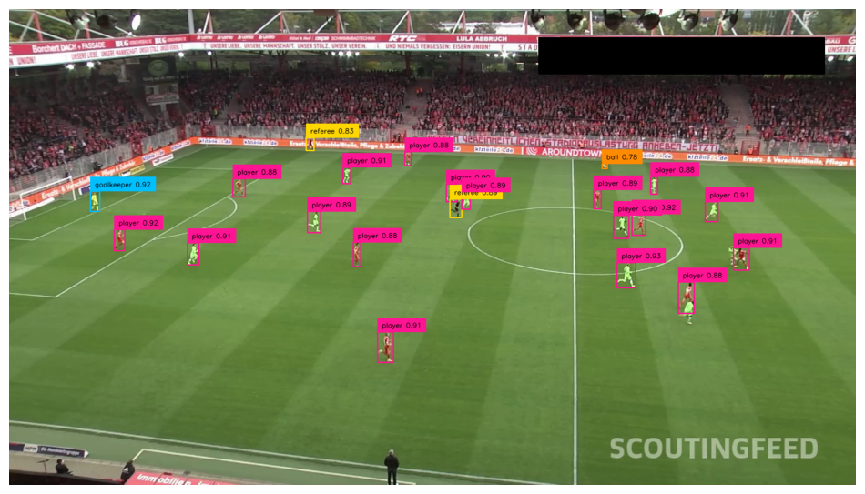

- To make it more immersive, the dboudning boxes are replaced with ellipses and traingle for the ball

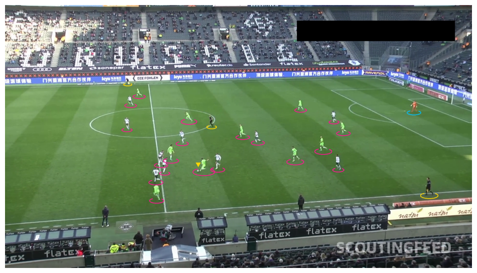


## Object Tracking
- Byte Track model was used to track players, referee and ball
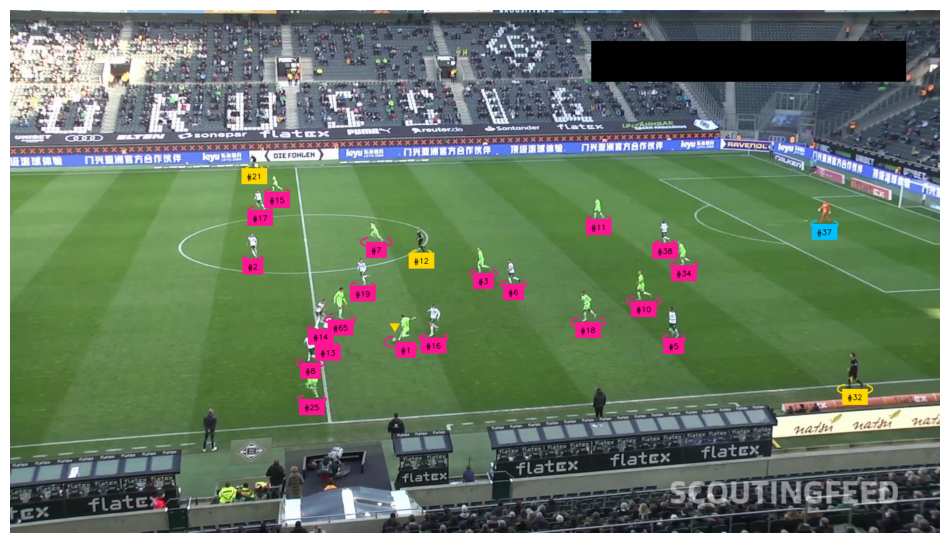

## Team Assignment
- FIrst SigLip embeddings are generated for the player detection images.
- The high dimensionl embeddings are reduced to 3 dimension using UMAP
- The Umap features are then Clustered into 2 clusters using K-means corresponding to each team


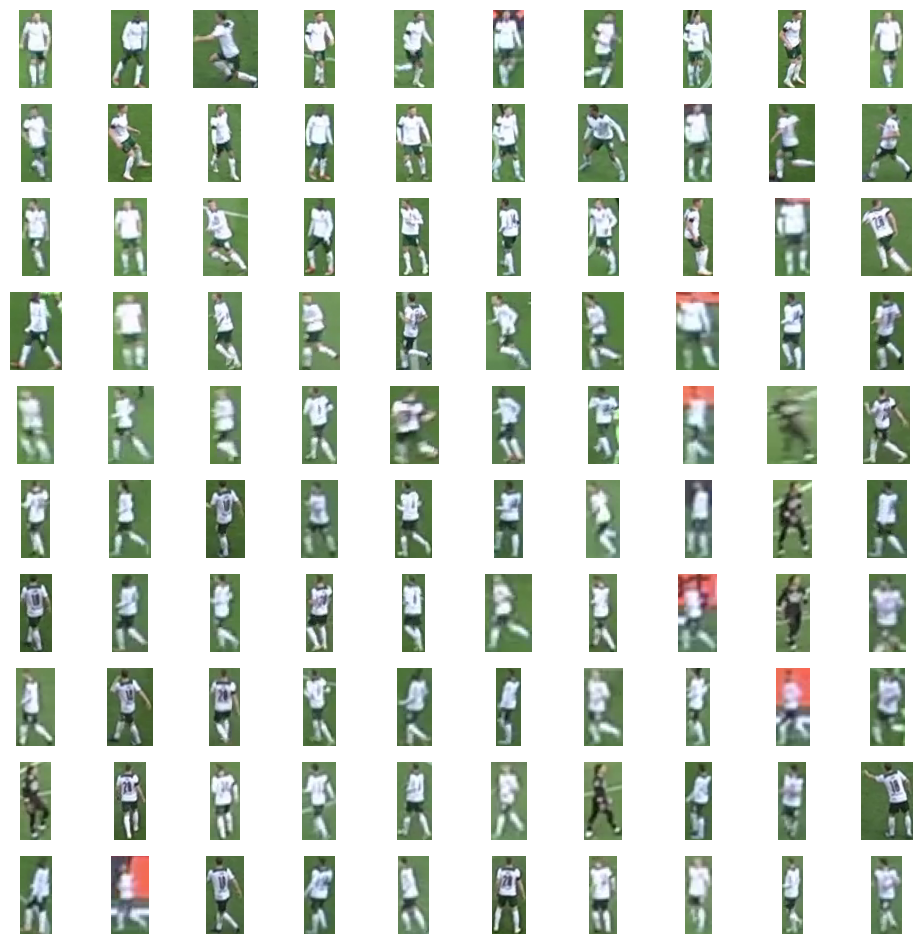

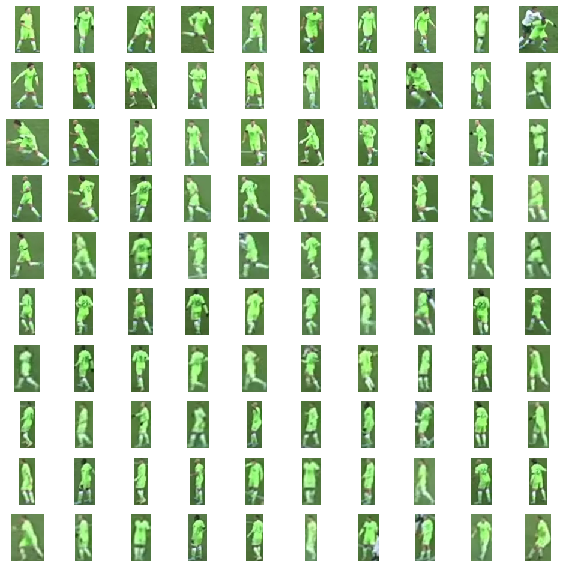

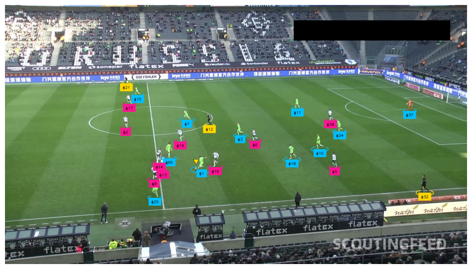

[VIDEO DEMO](https://www.canva.com/design/DAGkkoH6KHw/joxP6bqoyxks_JvjEcCntw/watch?utm_content=DAGkkoH6KHw&utm_campaign=designshare&utm_medium=link2&utm_source=uniquelinks&utlId=h216485b4d8)

## Radar View Projection : Keypoint Detection + homography tansformation

- Detect Keypoints:	Using a FIELD_DETECTION_MODEL (custom trained YOLO-posex) to find known field markings in the current video frame.
- Reference Mapping:	You already know where those keypoints should be on a standard pitch layout (e.g., your CONFIG.vertices).
- Compute Homography:	Use cv2.findHomography() or a custom transformer  to compute the matrix from frame → pitch.

- Warp Coordinates	Apply that homography to transform all player/ball positions to the radar view.

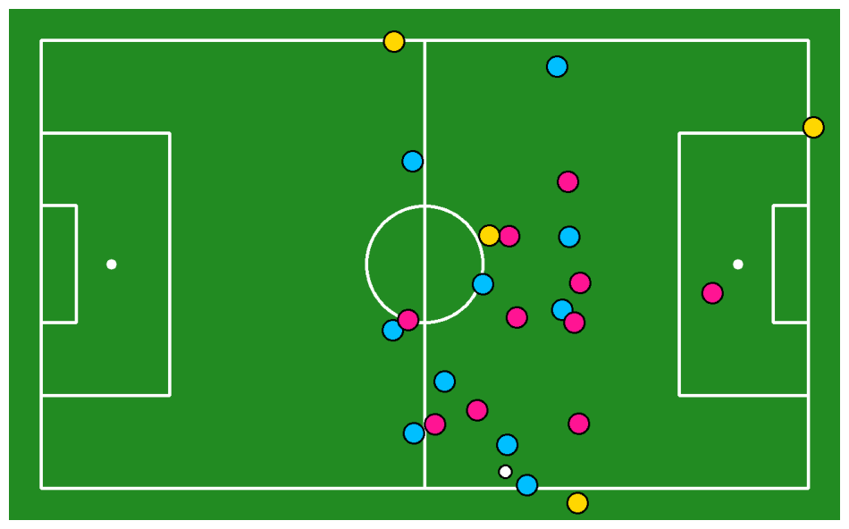

## Ball Tracking
- Detect objects and isolate the ball.
- Detect keypoints on the soccer field.
- Filter reliable keypoints for transformation.
- Compute homography between frame and pitch.
- Smooth homography using a rolling average of past transforms.
- Transform ball position from frame to pitch view.
- Append transformed ball coordinates to path history.

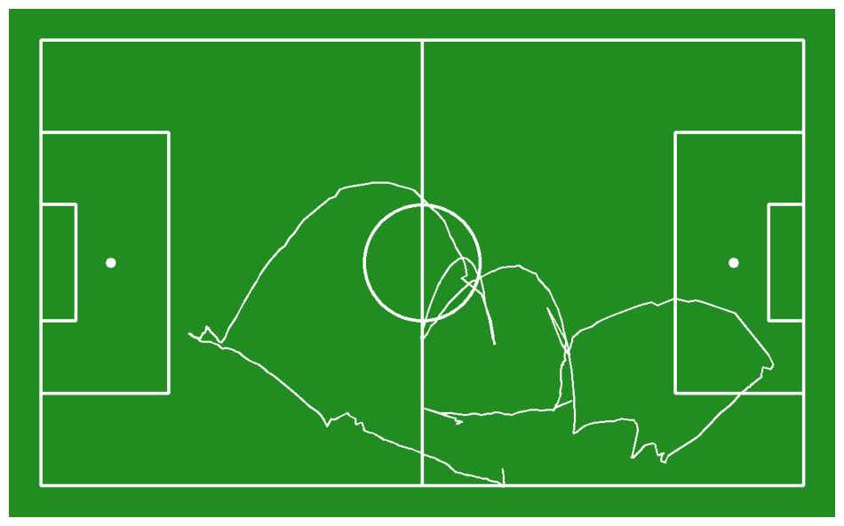

## Targeted Virtual Ad-Overlay
- Use the FIELD_DETECTION_MODEL to detect keypoints on the pitch in each frame.
- Filter confident keypoints and match them to known pitch coordinates.
- Compute a homography (perspective transform) between frame and pitch coordinates.
- Optionally smooth the homography matrix using a moving average (deque).
- Define 2D coordinates of the virtual ad banner in the pitch coordinate system.
- Use the inverse of the homography to transform ad coordinates back to frame space.
- Warp and overlay the ad image onto the frame using the transformed points (e.g., cv2.warpPerspective).
- Ensure the ad is blended realistically with the field (optional alpha blending / shadows).

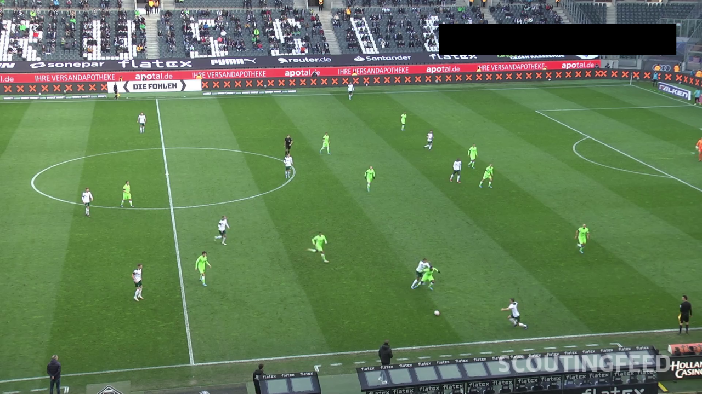
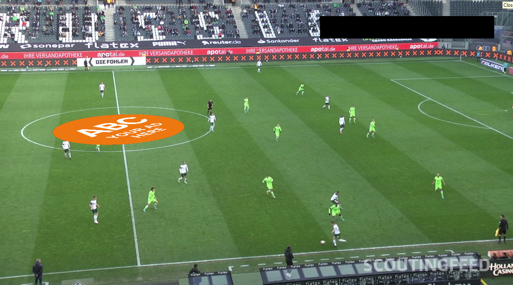
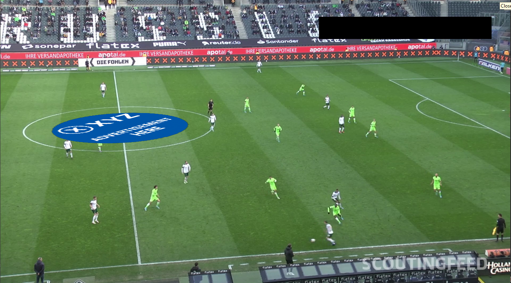


## Installation

1. Clone the repository:
   ```bash
   git clone https://github.com/your-username/FootBall-Computer-Vision.git
   cd FootBall-Computer-Vision
   ```

